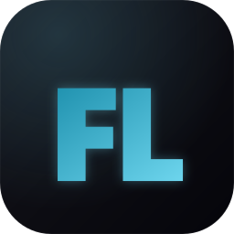

<div align="center">



# Folio

### AI-асистент для управління фінансами у [Finmap](https://finmap.online)

Десктоп-додаток на базі Claude Code SDK. Автоматизує рутину обліку, підключає інтеграції за хвилини, звіряє виписки за секунди.

[](https://github.com/vitalii98t/folio/actions/workflows/build.yml)
[](https://github.com/vitalii98t/folio/releases/latest)
[](LICENSE)
[](https://www.typescriptlang.org/)
[](https://www.electronjs.org/)

[](https://github.com/vitalii98t/folio/releases/latest)
[](https://github.com/vitalii98t/folio/releases/latest)
[](https://github.com/vitalii98t/folio/releases/latest)

**[⬇️ Завантажити останню версію](https://github.com/vitalii98t/folio/releases/latest)**

</div>

---

## ✨ Що вміє

- 🤖 **Чат із Claude** який має повний доступ до Finmap API через 41 MCP-тул
- ⚡ **Інтеграції за 10 хвилин** — кидаєш API-доку, Claude сам пише і запускає sync
- 📊 **Звірка виписок** — drag PDF/Excel/CSV у чат, миттєвий звіт що відсутнє/зайве/розбіжне
- ⏰ **Автозадачі за розкладом** — Claude сам категоризує/синхронізує/звіряє кожні N хвилин
- 📈 **Графіки в чаті** — *"Покажи витрати за квартал у вигляді pie chart"* → готово
- 🔍 **Пошук Ctrl+K** по всій історії чатів
- 🏢 **Multi-company** з ізольованими сесіями (свій API-ключ для кожної)
- 🛡️ **Підтвердження дій** перед будь-якою зміною даних у Finmap

## 📸 Демо

<div align="center">

> *(тут буде GIF з основними сценаріями — додам після першого Demo Day)*

</div>

## 📦 Встановлення

### Передумова — Claude Code CLI

Folio працює поверх **Claude Code CLI**. Можеш встановити його **через кнопку всередині Folio** (Setup-екран при першому запуску) або руками:

| ОС | Команда |
|---|---|
| **Windows** | `curl -fsSL https://claude.ai/install.cmd -o install.cmd && install.cmd && del install.cmd` |
| **macOS / Linux** | `curl -fsSL https://claude.ai/install.sh \| sh` |

Після встановлення:
```
claude login
```

> ℹ️ Після встановлення Claude Code **перезапустіть Folio**, щоб додаток підхопив новий PATH.

### 🪟 Windows

1. Завантаж `Folio Setup X.X.X.exe` з [останнього релізу](https://github.com/vitalii98t/folio/releases/latest)
2. Двічі клікни `.exe`
3. Якщо SmartScreen покаже **"Windows protected your PC"** → `More info` → `Run anyway`
4. Майстер встановлення → обираєш папку → Install
5. Запускай через ярлик у Start Menu

> **Дані:** `%APPDATA%\folio\` (історія, налаштування, автозадачі)

### 🍎 macOS

| Mac | Файл |
|---|---|
| **Apple Silicon** (M1/M2/M3/M4) | `Folio-X.X.X-arm64.dmg` |
| **Intel** | `Folio-X.X.X.dmg` |

> Не знаєш який? Меню `` → `About This Mac` → "Chip: Apple M..." це Apple Silicon.

1. Завантаж `.dmg` з [релізу](https://github.com/vitalii98t/folio/releases/latest)
2. Двічі клікни → перетягни **Folio** у `Applications`
3. **Перший запуск:** через відсутність Apple Developer ID треба зняти quarantine. У Terminal:
   ```bash
   xattr -cr /Applications/Folio.app
   ```
4. Запускай з Applications

> **Дані:** `~/Library/Application Support/folio/`

### 🐧 Linux

1. Завантаж `Folio-X.X.X.AppImage` з [релізу](https://github.com/vitalii98t/folio/releases/latest)
2. Дай право на виконання:
   ```bash
   chmod +x Folio-*.AppImage
   ```
3. Запускай:
   ```bash
   ./Folio-*.AppImage
   ```

> **Дані:** `~/.config/folio/`

## 🚀 Перші кроки

1. **Setup-екран** перевіряє чи встановлений Claude Code. Якщо ні — кнопка `Встановити Claude Code` відкриває термінал зі скриптом
2. **Авторизуйся:** кнопка `Увійти в Claude Code` → у терміналі запуститься `claude login`
3. **Додай компанію:** натисни `+` у sidebar → введи назву + Finmap API-ключ
   - Ключ: **Finmap → Налаштування → API**
4. **Питай у чат:** *"Покажи витрати за серпень по категоріях"*

## 💬 Що можна питати

```
Покажи витрати за серпень по категоріях у вигляді графіка
Звір цю виписку з рахунком ПриватБанк UAH        (+ прикріпити PDF/CSV)
Знайди операції без категорії за минулий тиждень і поставь категорії з коментаря
Підключи інтеграцію з нашою CRM, ось API-доку    (+ скинути доку)
Розрахуй чистий прибуток за квартал по проекту X
Знайди дублікати у вхідних платежах
Розділи цей платіж 50/50 між проєктами Маркетинг і Дослідження
```

## 🛠️ Технологічний стек

| | |
|---|---|
| **Runtime** | Electron 33 |
| **UI** | React 19 + Vite + TypeScript |
| **AI** | [Claude Code SDK](https://www.npmjs.com/package/@anthropic-ai/claude-code) (agentic, MCP-based) |
| **Графіки** | Recharts |
| **Storage** | Local JSON (per-user `userData`) |
| **Packaging** | electron-builder + GitHub Actions |

## 🔧 Збірка з вихідного коду

```bash
git clone https://github.com/vitalii98t/folio.git
cd folio
npm install
npm run icons       # генерує іконки з SVG
npm run build       # компілює main + renderer
npm run dist:win    # збирає Windows installer
# або: dist:linux  (тільки на Linux/CI з fpm)
# або: dist:mac    (тільки на macOS)
```

Готовий файл — у `release/`.

Workflow для CI/CD: [.github/workflows/build.yml](.github/workflows/build.yml) — збирає всі 3 платформи паралельно при push.

## 📂 Структура

```
src/
├── main/           # Node.js процес: IPC, MCP сервер, scheduler, AgentManager
│   ├── main.ts             # entry point
│   ├── agent-manager.ts    # Claude Code SDK wrapper
│   ├── mcp-tools.ts        # 41 MCP-тул для Finmap API
│   ├── sync-scheduler.ts   # автозадачі + автосинхронізація
│   └── system-prompt.ts    # інструкції для Claude
├── renderer/       # React UI
│   ├── components/         # ChatView, Sidebar, модалки, чарти
│   ├── styles/             # CSS modules (Frozen Sky тема)
│   └── hooks/              # useVoiceInput тощо
└── shared/types.ts # IPC контракти + типи
```

## 🗺️ Roadmap

- [ ] **Голосовий чат** — диктуєш витрату → Claude парсить
- [ ] **Email/IMAP парсинг** — виписки з пошти автоматично
- [ ] **Marketplace** — публікація як перший продукт у Finmap Marketplace для незалежних розробників

## 👤 Автор

**Vitalii Tovkes** — розробник [Finmap](https://finmap.online)

[](https://github.com/vitalii98t)

## 📄 Ліцензія

MIT — деталі у файлі [LICENSE](LICENSE).
