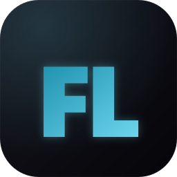

<div align="center">



# Folio

### AI-асистент для управління фінансами у [Finmap](https://finmap.online)

Десктоп-додаток на базі Claude Code SDK. Автоматизує рутину обліку, підключає інтеграції за хвилини, звіряє виписки за секунди, працює з **будь-яким MCP-сервером** з коробки.

[](https://github.com/vitalii98t/folio/actions/workflows/build.yml)
[](https://github.com/vitalii98t/folio/releases/latest)
[](LICENSE)
[](https://www.typescriptlang.org/)
[](https://www.electronjs.org/)

[](https://github.com/vitalii98t/folio/releases/latest)
[](https://github.com/vitalii98t/folio/releases/latest)
[](https://github.com/vitalii98t/folio/releases/latest)

**[⬇️ Завантажити останню версію](https://github.com/vitalii98t/folio/releases/latest)**

</div>

---

## ✨ Що вміє

- 🤖 **Чат із Claude** з повним доступом до Finmap API через ~50 MCP-тулів
- 🧠 **12 спеціалізованих скілів** — звірка виписки, інтеграції, прогноз cashflow, податковий звіт ФОП, фото чека → операція, MCP-підключення тощо. Активуються автоматично за тригер-фразами
- 🔌 **Універсальні MCP-сервери** — підключай **будь-який сервіс** (Notion, Jira, GitHub, Linear, Slack…) через UI або просто словами в чаті. Скіл `mcp-setup` робить це за тебе
- 📦 **Bundled runtimes** — `uv`/`uvx` і Node.js 22 LTS поставляються разом з Folio. **Не треба нічого ставити окремо** — MCP-сервери стартують з коробки
- 📂 **Імпорт із Google Drive** — даєш посилання на папку, Folio підхоплює нові виписки автоматично кожні N хвилин (нативний wizard, без OAuth)
- 📊 **Google Sheets інтеграція** — Service Account JSON → Folio зберігає і Claude пише/читає таблиці
- ⚡ **Інтеграції за 10 хвилин** — кидаєш API-доку, Claude сам пише і запускає sync
- 📊 **Звірка виписок** — drag PDF/Excel/CSV у чат, миттєвий звіт що відсутнє/зайве/розбіжне (детермінований 3-pass matcher у Node)
- ⏰ **Автозадачі за розкладом** — Claude сам категоризує/синхронізує/звіряє кожні N хвилин. Працює і для MCP-серверів. Можна тригернути руками
- 📈 **Графіки в чаті** — *"Покажи витрати за квартал у вигляді pie chart"* → готово
- 🔍 **Пошук Ctrl+K** по всій історії чатів
- 🏢 **Multi-company** з ізольованими сесіями (свій API-ключ для кожної)
- 🛡️ **Підтвердження дій** перед будь-якою зміною даних у Finmap
- 🔓 **MCP-only режим** — компанія без Finmap-ключа, тільки сторонні сервіси через MCP
- 🚪 **Вилогінитись з Claude** — кнопка в sidebar, на випадок проблем з токеном

## 📸 Демо

<div align="center">

> *(тут буде GIF з основними сценаріями — додам після першого Demo Day)*

</div>

## 📦 Встановлення

### Передумова — Claude Code CLI

Folio працює поверх **Claude Code CLI**. Можеш встановити його **через кнопку всередині Folio** (Setup-екран при першому запуску) або руками:

| ОС | Команда |
|---|---|
| **Windows** | `curl -fsSL https://claude.ai/install.cmd -o install.cmd && install.cmd && del install.cmd` |
| **macOS / Linux** | `curl -fsSL https://claude.ai/install.sh \| sh` |

Після встановлення:
```
claude login
```

> ℹ️ Після встановлення Claude Code **перезапустіть Folio**, щоб додаток підхопив новий PATH.

> 💡 `uv` (для Python MCP-серверів) і Node.js 22 LTS (для npx-based MCP) **уже всередині Folio** — окремо ставити не треба.

### 🪟 Windows

1. Завантаж `Folio Setup X.X.X.exe` з [останнього релізу](https://github.com/vitalii98t/folio/releases/latest)
2. Двічі клікни `.exe`
3. Якщо SmartScreen покаже **"Windows protected your PC"** → `More info` → `Run anyway`
4. Майстер встановлення → обираєш папку → Install
5. Запускай через ярлик у Start Menu

> **Дані:** `%APPDATA%\folio\` (історія, налаштування, автозадачі, MCP-конфіги)

### 🍎 macOS

| Mac | Файл |
|---|---|
| **Apple Silicon** (M1/M2/M3/M4) | `Folio-X.X.X-arm64.dmg` |
| **Intel** | `Folio-X.X.X.dmg` |

> Не знаєш який? Меню `` → `About This Mac` → "Chip: Apple M..." це Apple Silicon.

1. Завантаж `.dmg` з [релізу](https://github.com/vitalii98t/folio/releases/latest)
2. Двічі клікни → перетягни **Folio** у `Applications`
3. **Перший запуск:** через відсутність Apple Developer ID треба зняти quarantine. У Terminal:
   ```bash
   xattr -cr /Applications/Folio.app
   ```
4. Запускай з Applications

> **Дані:** `~/Library/Application Support/folio/`

### 🐧 Linux

1. Завантаж `Folio-X.X.X.AppImage` з [релізу](https://github.com/vitalii98t/folio/releases/latest)
2. Дай право на виконання:
   ```bash
   chmod +x Folio-*.AppImage
   ```
3. Запускай:
   ```bash
   ./Folio-*.AppImage
   ```

> **Дані:** `~/.config/folio/`

## 🚀 Перші кроки

1. **Setup-екран** перевіряє чи встановлений Claude Code. Якщо ні — кнопка `Встановити Claude Code` відкриває термінал зі скриптом
2. **Авторизуйся:** кнопка `Увійти в Claude Code` → у терміналі запуститься `claude login`
3. **Додай компанію:** натисни `+` у sidebar:
   - **З Finmap:** введи назву + Finmap API-ключ (ключ: **Finmap → Налаштування → API**)
   - **Без Finmap (MCP-only):** залиш API-ключ порожнім — використовуй Folio як універсального оркестратора над MCP-серверами
4. **Питай у чат:** *"Покажи витрати за серпень по категоріях"*

## 💬 Що можна питати

```
Покажи витрати за серпень по категоріях у вигляді графіка
Звір цю виписку з рахунком ПриватБанк UAH        (+ прикріпити PDF/CSV)
Знайди операції без категорії за минулий тиждень і поставь категорії з коментаря
Підключи інтеграцію з нашою CRM, ось API-доку    (+ скинути доку)
Підключи MCP Notion                              (Claude встановить і налаштує сам)
Імпортуй виписки із цієї Google Drive папки      (+ посилання)
Розрахуй чистий прибуток за квартал по проекту X
Знайди дублікати у вхідних платежах
Розділи цей платіж 50/50 між проєктами Маркетинг і Дослідження
Додай цю звірку в автозадачі щодня о 9:00
```

## 🔌 Універсальні інтеграції через MCP

Folio працює з **будь-яким MCP-сервером** — це стандарт від Anthropic для розширення AI-агентів інструментами зовнішніх сервісів. Поки що в реєстрі вже сотні готових серверів:

| Сервіс | Як підключити |
|--------|---------------|
| **Notion** / **Jira** / **Linear** | `npx -y @modelcontextprotocol/server-*` — Claude робить все сам |
| **GitHub** / **Slack** / **Atlassian** | Аналогічно через UI або фразу *"підключи [сервіс]"* |
| **Google Sheets** | Service Account JSON → Folio зберігає в `userData/credentials/` |
| **Google Drive** (read-only) | Нативний wizard — API-ключ + посилання на папку |
| **Custom HTTP API** | `integration-setup` скіл напише MCP-проксі за тебе |

**Налаштування:** `Налаштування → MCP-сервери → + Додати` або просто в чаті: *"підключи Notion"*.

Скіл `mcp-setup` робить розвідку — шукає офіційний пакет, питає необхідні env-змінні (без записування токенів в історію), запускає сервер, перевіряє що тули видно Claude.

## 📂 Імпорт з Google Drive

Якщо банк/CRM кидає виписки у Google Drive як CSV/Excel/PDF — Folio може автоматично їх підхоплювати:

1. `Налаштування → Folder Import → +`
2. Вводиш API-ключ Google (свій — щоб дані не йшли через нас)
3. Кидаєш посилання на папку (вона має бути з доступом *Anyone with link → Viewer*)
4. Обираєш Finmap-рахунок куди приземляти операції
5. Виставляєш інтервал (15хв … 1 тиждень)

Folio періодично сканує папку, нові файли пушить Claude для парсингу + створення операцій з дедупом через `check_externalIds`. Прогрес видно у тултіпі прямо на binding-карті.

## 🧠 Спеціалізовані скіли

Folio постачається з 12 готовими **скілами** — папками інструкцій у `resources/skills/`, які Claude підвантажує автоматично, коли запит юзера матчиться з тригер-фразами скіла. Це винесена з основного промта спеціалізована логіка, що тримає основний промт коротким і дає однакову поведінку на повторюваних задачах.

| Скіл | Тригер | Що робить |
|------|--------|-----------|
| `reconcile-statement` | "звір виписку" + файл | 3-pass детермінований matcher (1:1 / split / shifted-date), презентація у 5 групах |
| `integration-setup` | "+ Інтеграція" / "підключи [сервіс]" | Розбирає API-доку, робить першу синхронізацію, зберігає `syncPrompt` для авто-синку |
| `integration-modify` | "змінюй інтеграцію" / "поміняй інтервал" | Update-only, захист від duplicate-save бага |
| `mcp-setup` | "підключи MCP" / "+ Notion / GitHub / …" | Знаходить офіційний пакет, питає env-токени поза історією, запускає сервер |
| `folder-import-setup` | "імпорт з Google Drive" / "слідкуй за папкою" | Інструктує юзера через 6-крокового wizard, налаштовує авто-імпорт |
| `mass-import` | прикріплений Excel/CSV + "імпортуй" | Батч-парсинг + `check_externalIds` дедуп + chunked create |
| `split-operations` | "розділи 50/50" / "70% на X" | Project-split XOR category-split, валідація стейків |
| `charts-output` | "візуалізуй" / "покажи графіком" | bar/line/pie через `finapse-chart` fenced-блок |
| `receipt-from-photo` | фото чека + "ось чек" | Vision-парсинг, мапінг на категорію + контрагент |
| `tax-quarterly-report` | "квартальний звіт ФОП" | UA-специфіка: групи ЄП, ліміти, дедлайни |
| `cashflow-forecast` | "прогноз" / "вистачить грошей" | Detect recurring → forecast next 1-3 months |
| `period-summary` | "підсумки місяця/кварталу" | Стандартизований формат з порівнянням до попереднього періоду |

Скіли вантажаться **on-demand** — коли заявка не матчиться з жодним, контекст лишається мінімальним. Бекграунд-задачі (sync, scheduled tasks) запускаються з окремим лін-промтом, без скільної логіки взагалі.

Детальніше про архітектуру скілів — у `docs/product-overview.md`.

## ⏰ Автозадачі

Будь-що, що Claude вміє робити в чаті — можна поставити на розклад. Працює і для Finmap-операцій, і для MCP-серверів.

- **Створення з чату:** *"додай цю звірку в автозадачі щодня о 9:00"* — Claude сам збереже промпт + інтервал
- **Створення з UI:** Налаштування → Автозадачі → +
- **Ручний тригер:** кнопка ▶ Run прямо на карті задачі (не чекаєш наступного тіку)
- **MCP-aware:** задача знає які MCP-сервери треба запустити перед стартом
- **Лін-промт:** для бекграунду без скілів — швидко, дешево, передбачувано

## 🛠️ Технологічний стек

| | |
|---|---|
| **Runtime** | Electron 33 |
| **UI** | React 19 + Vite + TypeScript |
| **AI** | [Claude Code SDK](https://www.npmjs.com/package/@anthropic-ai/claude-code) (agentic, MCP-based) |
| **Bundled runtimes** | [`uv`](https://github.com/astral-sh/uv) (Python MCP), Node.js 22 LTS (npx MCP) — per-platform |
| **Графіки** | Recharts |
| **Storage** | Local JSON (per-user `userData`) |
| **Packaging** | electron-builder + GitHub Actions |

## 🔧 Збірка з вихідного коду

```bash
git clone https://github.com/vitalii98t/folio.git
cd folio
npm install
npm run fetch-binaries   # тягне uv + Node.js 22 для поточної платформи (~130MB)
npm run icons            # генерує іконки з SVG
npm run build            # компілює main + renderer
npm run dist:win         # збирає Windows installer
# або: dist:linux  (тільки на Linux/CI з fpm)
# або: dist:mac    (тільки на macOS)
```

Готовий файл — у `release/`.

Workflow для CI/CD: [.github/workflows/build.yml](.github/workflows/build.yml) — збирає всі 3 платформи паралельно при push.

## 📂 Структура

```
src/
├── main/                       # Node.js процес: IPC, MCP сервер, scheduler, AgentManager
│   ├── main.ts                 # entry point
│   ├── agent-manager.ts        # Claude Code SDK wrapper, вибір system-prompt варіанту
│   ├── mcp-tools.ts            # ~50 MCP-тулів: Finmap, file bindings, scheduled tasks, gdrive_*, MCP self-management
│   ├── reconcile-matcher.ts    # детермінований 3-pass matcher
│   ├── gdrive-client.ts        # REST-based Drive клієнт з API-ключем (без OAuth)
│   ├── bundled-binaries.ts     # prepend resources/binaries/<plat-arch> у PATH при старті
│   ├── skills-installer.ts     # копіює бандл-скіли у workspace при старті
│   ├── sync-scheduler.ts       # автозадачі + автосинхронізація + file bindings
│   └── system-prompt.ts        # три варіанти: UI / BG / MCP-only
├── renderer/                   # React UI
│   ├── components/
│   │   ├── ChatView.tsx
│   │   ├── Sidebar.tsx         # + кнопка "Вийти з Claude"
│   │   ├── McpServersSection.tsx     # UI керування MCP-серверами
│   │   ├── FileBindingsSection.tsx   # авто-імпорт із папок
│   │   ├── FolderImportWizard.tsx    # 6-крокова майстерня GDrive
│   │   └── …
│   ├── styles/                 # CSS modules (Frozen Sky тема)
│   └── hooks/                  # useVoiceInput тощо
├── shared/types.ts             # IPC контракти + типи (FileImportBinding, McpServerConfig, …)
└── ../resources/
    ├── skills/                 # 12 спеціалізованих скілів (бандляться у release)
    └── binaries/<plat-arch>/   # uv, uvx, node (тягнуться через fetch-binaries перед dist)
```

## 🗺️ Roadmap

- [ ] **Голосовий чат** — диктуєш витрату → Claude парсить
- [ ] **Email/IMAP парсинг** — виписки з пошти автоматично
- [ ] **Паралельні агенти** — кілька запитів обробляються одночасно
- [ ] **Marketplace** — публікація як перший продукт у Finmap Marketplace для незалежних розробників

## 💬 Спільнота і фідбек

Знайшов баг, є ідея, хочеш щось обговорити — заходь:

- 🐛 **[Bug report](https://github.com/vitalii98t/folio/issues/new?template=bug_report.yml)** — щось не працює як очікувалось
- ✨ **[Feature request](https://github.com/vitalii98t/folio/issues/new?template=feature_request.yml)** — пропозиція нової фічі
- 🔌 **[Integration request](https://github.com/vitalii98t/folio/issues/new?template=integration_request.yml)** — потрібен новий сервіс
- 💭 **[Discussions](https://github.com/vitalii98t/folio/discussions)** — питання, обговорення, шеринг шаблонів

Усі issues українською або англійською. Перед створенням — глянь чи [подібне вже не є](https://github.com/vitalii98t/folio/issues).

## 👤 Автор

**Vitalii Tovkes** — розробник [Finmap](https://finmap.online)

[](https://github.com/vitalii98t)

## 📄 Ліцензія

MIT — деталі у файлі [LICENSE](LICENSE).
